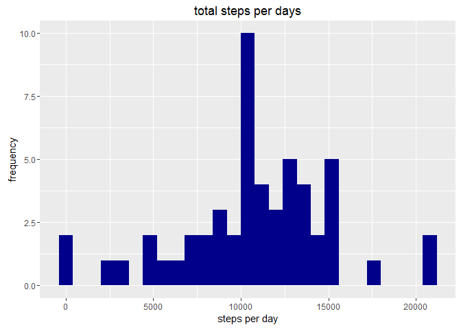
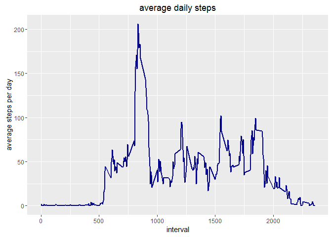
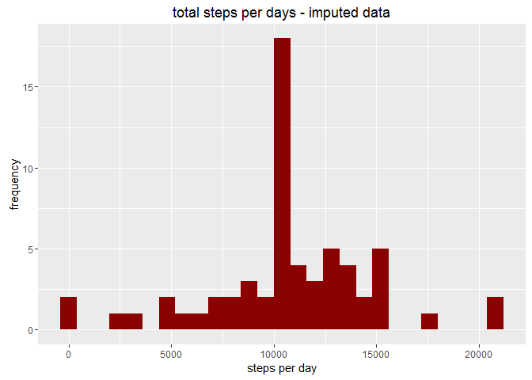
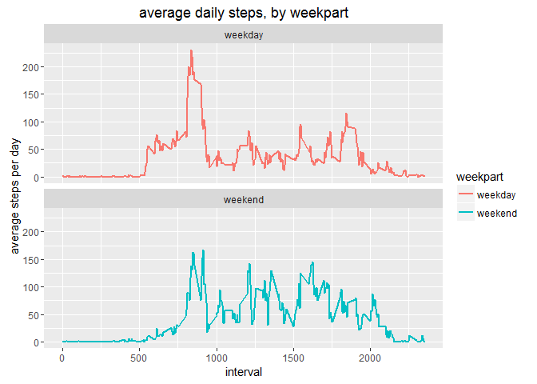

# Reproducible assignment 1 - activity monitoring
fruzsi  
19 November 2016  

Loading packages


```r
library(dplyr)
```

```
## Warning: package 'dplyr' was built under R version 3.2.5
```

```
## 
## Attaching package: 'dplyr'
```

```
## The following objects are masked from 'package:stats':
## 
##     filter, lag
```

```
## The following objects are masked from 'package:base':
## 
##     intersect, setdiff, setequal, union
```

```r
library(ggplot2)
```

```
## Warning: package 'ggplot2' was built under R version 3.2.5
```


# Setting parameters, loading data, and having a peak


```r
DIR <-'C:\\Users\\fishie\\Desktop\\coursera\\repoClone\\datasciencecoursera\\replic_assignmnent1'
fname <- 'activity.csv'
data <- read.csv(paste(DIR,'\\', fname, sep=''))
head(data)
```

```
##   steps       date interval
## 1    NA 2012-10-01        0
## 2    NA 2012-10-01        5
## 3    NA 2012-10-01       10
## 4    NA 2012-10-01       15
## 5    NA 2012-10-01       20
## 6    NA 2012-10-01       25
```

```r
summary(data)
```

```
##      steps                date          interval     
##  Min.   :  0.00   2012-10-01:  288   Min.   :   0.0  
##  1st Qu.:  0.00   2012-10-02:  288   1st Qu.: 588.8  
##  Median :  0.00   2012-10-03:  288   Median :1177.5  
##  Mean   : 37.38   2012-10-04:  288   Mean   :1177.5  
##  3rd Qu.: 12.00   2012-10-05:  288   3rd Qu.:1766.2  
##  Max.   :806.00   2012-10-06:  288   Max.   :2355.0  
##  NA's   :2304     (Other)   :15840
```

# Mean total number of steps taken per day

Transform date column from character to Date object 


```r
data$date <- as.Date(data$date)
```

Calculate number of steps per day


```r
steps_stat <- data %>%
    group_by(date) %>%
    filter(!is.na(steps)) %>%
    summarize(stepcount = sum(steps))

steps_stat
```

```
## Source: local data frame [53 x 2]
## 
##          date stepcount
##        (date)     (int)
## 1  2012-10-02       126
## 2  2012-10-03     11352
## 3  2012-10-04     12116
## 4  2012-10-05     13294
## 5  2012-10-06     15420
## 6  2012-10-07     11015
## 7  2012-10-09     12811
## 8  2012-10-10      9900
## 9  2012-10-11     10304
## 10 2012-10-12     17382
## ..        ...       ...
```

Plot step counts per day


```r
p <- ggplot(steps_stat, aes(stepcount))
p + geom_histogram(binwidth = 800, fill='darkblue') +
    labs(title='total steps per days', x='steps per day', y='frequency')
```

<!-- -->

Mean and median of steps taken a day


```r
# Mean:
mean(steps_stat$stepcount)
```

```
## [1] 10766.19
```

```r
# Median:
median(steps_stat$stepcount)
```

```
## [1] 10765
```

# Discover average daily pattern

Calculate average steps per intervals


```r
steps_stat <- data %>%
    group_by(interval) %>%
    filter(!is.na(steps)) %>%
    summarize(stepavg = mean(steps))

steps_stat
```

```
## Source: local data frame [288 x 2]
## 
##    interval   stepavg
##       (int)     (dbl)
## 1         0 1.7169811
## 2         5 0.3396226
## 3        10 0.1320755
## 4        15 0.1509434
## 5        20 0.0754717
## 6        25 2.0943396
## 7        30 0.5283019
## 8        35 0.8679245
## 9        40 0.0000000
## 10       45 1.4716981
## ..      ...       ...
```

Plot average daily steps


```r
p <- ggplot(steps_stat, aes(x=interval, y=stepavg))
p + geom_line(col='darkblue', size=1) +
    labs(title='average daily steps', x='interval', y='average steps per day')
```

<!-- -->

Find the 5-minute interwal that on average contains the most number of steps


```r
steps_stat[which.max(steps_stat$stepavg),]
```

```
## Source: local data frame [1 x 2]
## 
##   interval  stepavg
##      (int)    (dbl)
## 1      835 206.1698
```


# Imputing missing values

number of missing values in the dataset


```r
sum(is.na(data$steps))
```

```
## [1] 2304
```


```r
na.ind <- is.na(data$steps)
data.means <- tapply(data$steps, data$interval, mean, na.rm=T, simplify=T)
data.imputed <- data
data.imputed$steps[na.ind] <- data.means[as.character(data$interval[na.ind])]
sum(is.na(data.imputed$steps))
```

```
## [1] 0
```

Histogram of total number of steps per days - imputed data


```r
steps_stat <- data.imputed %>%
    group_by(date) %>%
    filter(!is.na(steps)) %>%
    summarize(stepcount = sum(steps))

# plot
p <- ggplot(steps_stat, aes(stepcount))
p + geom_histogram(binwidth = 800, fill='darkred') +
    labs(title='total steps per days - imputed data', x='steps per day', y='frequency')
```

<!-- -->

Mean and median of steps taken a day - imputed data


```r
# Mean - imputed data:
mean(steps_stat$stepcount)
```

```
## [1] 10766.19
```

```r
# Median - imputed data:
median(steps_stat$stepcount)
```

```
## [1] 10766.19
```
-> imputing values didn't make very much of a difference; moved the median closer (to the same) to the mean, but that's not unexpected, after imputing mean values

# Differences between activity patterns on weekdays vs weekends

Create factor variable for weekday and weekend


```r
data.imputed <- data.imputed %>%
    mutate(weekpart = ifelse(weekdays(date)=='Saturday' | 
                                  weekdays(date)=='Sunday',
                              'weekend', 'weekday'))

# statistics
steps_stat <- data.imputed %>%
    group_by(interval,weekpart) %>%
    summarize(stepavg = mean(steps))

head(steps_stat)
```

```
## Source: local data frame [6 x 3]
## Groups: interval [3]
## 
##   interval weekpart    stepavg
##      (int)    (chr)      (dbl)
## 1        0  weekday 2.25115304
## 2        0  weekend 0.21462264
## 3        5  weekday 0.44528302
## 4        5  weekend 0.04245283
## 5       10  weekday 0.17316562
## 6       10  weekend 0.01650943
```

```r
# plot
p <- ggplot(steps_stat, aes(x=interval, y=stepavg, color=weekpart))
p + geom_line(size=1) +
    facet_wrap(~weekpart,nrow=2,ncol=1) +
    labs(title='average daily steps, by weekpart', x='interval', 
         y='average steps per day')
```

<!-- -->


-> Subject seems to be more active during workdays in the morning, but then a bit more active during the day in the weekends

